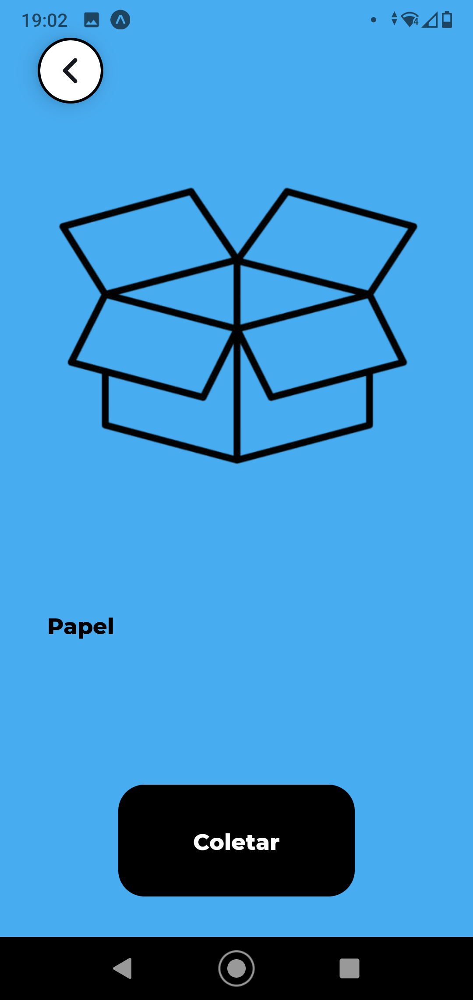

<!-- PROJECT LOGO -->
<br />
<p align="center">
  
  <h3 align="center">Coletaço</h3>
  <p align="center">
    Coleta inteligente é com a gente!
  </p>
</p>

<!-- ABOUT THE PROJECT -->
## Sobre o projeto

O projeto tem o intuito de ajudar os catadores de materiais recicláveis por meio da ajuda de colaboradores, os quais vão sinalizar localizações específicas que o catador possa pegar uma boa quantidade de coletas sem que precise ficar vagando em possíveis lugares que não tenham estes materiais


### Tecnologias principais

* [React Native](https://reactnative.dev)
* [Expo](https://expo.io)
* [ExpressJS](https://expressjs.com/pt-br/)
* [Axios](https://github.com/axios/axios)
* [mssql](https://github.com/tediousjs/node-mssql)
* [SQL Server](https://www.microsoft.com/pt-br/sql-server)

<!-- GETTING STARTED -->
## Como utilizar ?

O usuário pode acessá-lo a por meio do QR code abaixo, utilizando o app do Expo.
    
- 1º - Baixe o aplicativo do EXPO por meio deste [link](https://play.google.com/store/apps/details?id=host.exp.exponent&hl=pt_BR&gl=US) : 
- 2º - Com o aplicativo baixado, ao abri-lo, a primeira tela que irá aparecer é esta que está logo abaixo, basta clicar na primeira opção "Scan QR Code"
- 3º - Posteriormente, basta fazer a leitura do QR Code logo abaixo e o aplicativo "Coletaço" será aberto no seu celular.

<p align="center">
  
</p>


### Pré-requisitos

Você precisa ter instalado no seu computador o NodeJS e a ferramenta de execução Expo

### Instalação

1. Clone o repositório

2. Entre na pasta do aplicativo pelo terminal, digitando:
```sh
cd .\Coletaco\Coletaco\
```

3. Instale os pacotes necessários por meio do comando:
```sh
npm install
```

4. Rode no seu celular utilizando o expo, por meio do comando:
```sh
expo start
```


<!-- USAGE EXAMPLES -->
## Uso do aplicativo

<center>
<table>
<thead>
  <tr>
    <th></th>
    <th></th>
    <th></th>
    <th></th>
    <th></th>
    <th></th>
    <td></td>
  </tr>
</thead>
<tbody>
  <tr>
    <td></td>
    <td></td>
    <td></td>
    <td></td>
    <td></td>
    <td></td>
  </tr>
</tbody>
</table>

<div align="center">
  
  
</div>

<!-- LICENSE -->
## Licença

Distribuído a partir da lincença do MIT. Veja `LICENSE` para mais informação
